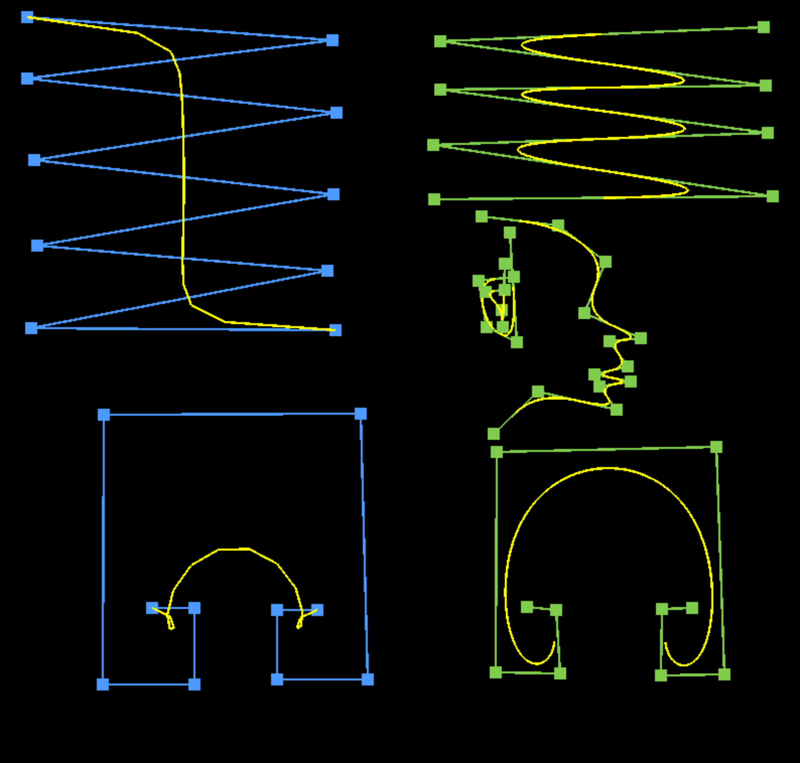
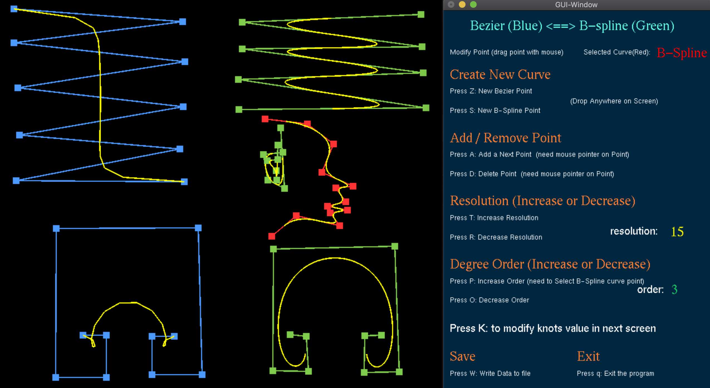

(Grade A) Project

Window size: 		GUI window size:
	Width = 800		Width = 480
	Height = 800 		Height = 700
	
			User-Guide
 
	step(1): enter ==> " make " <== to compile

	step(2): enter ==> " ./a.out " <== to run the program

===> This program no need to use command line(cmd) for any user input <===

- Select the curve by using mouse (GUI window will show which curve you select)

- Drag the point with mouse to move the point or modify

Create New Curve:

- Press (Z or z) to create new Bezier Point and drop anywhere you like in main screen. To add next point, mouse pointer on current point and press (A or a) after that drop anywhere in main screen.
- Press(S or s) to create new B-spline curve and drop anywhere in main screen. To add next point, mouse pointer on current point and press (A or a) after that drop anywhere in main screen.

*** Add/Remove (selected Point) ***

- Mouse pointer on any point with mouse after that => Press (A or a) <= to add next point and drop anywhere in main screen.
- Mouser pointer on any point that you want to delete and Press => (D or d) <= and it will delete current selected point.
 
*** Resolution (Increase or Decrease of the curve) ***

- Press (T or t) to increase resolution. (GUI window will show current resolution)
- Press (R or r) to decrease resolution.

*** Degree order(Increase or Decrease of the B-Spline Curve) ***

- Press (P or p) to increase degree order of B-Spline curve
- Press (O or o) to decrease degree order of B-Spline curve

*** Modify the knots value for B-Spline (selected B-Spline curve point) ***
- Press (K or k) to go current GUI window screen to Knots window screen
On Knots window screen, you can insert new knot value by clicking any knot value on screen
after that type any number 1 from 9 and press enter. B-spline curve will update for new knot.

For example:	
step(1) : T(2) => 2.000
Step(2) : T(2) => _	click the value with mouse
Step(3) : T(2) => 2.500 insert new value (like normal text input) and press enter. B-Spline will update immediately.

Save: press (W or w) to write data to original file the data is read in

Exit: When you press 'q' or 'Q', it will exit immediately. Any change will be saved in the original file the data is read in. Thanks

	      
	      
